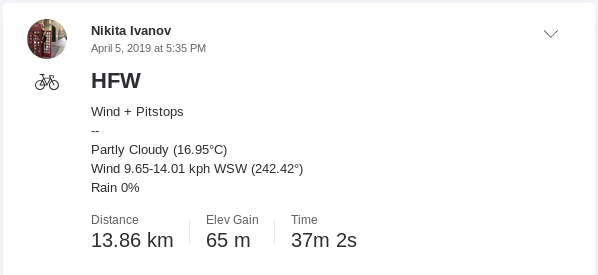

# Strava Statistics Analyzer

## Introduction

Strava Statistics Analyzer API provides a means to analyze similar rides in Strava to better assess averages and PRs over specified intervals.

## Strava Statistics Analyzer Console

This console application allows one to load Strava rides into a MySQL database from which they can then be more readily analyzed.

### Configuration

...

### Loading

```text
USAGE:

Load new rides since last update:
  dotnet run --project StravaStatisticsAnalyzerConsole.csproj -- load

Reload rides in given interval:
  dotnet run --project StravaStatisticsAnalyzerConsole.csproj -- load --endDate 2019/05/11 --reload --startDate 2019/05/05

Reload rides and segments in given interval with added weather information:
  dotnet run --project StravaStatisticsAnalyzerConsole.csproj -- load --endDate 2019/05/11 --reload --reloadSegments --startDate 2019/05/05 --weather

Reload ride with specific ID in given interval:
  dotnet run --project StravaStatisticsAnalyzerConsole.csproj -- load --endDate 2019/05/11 --id 2296595173 --reload --startDate 2019/05/05

  --reload            Reload the rides from Strava

  --reloadSegments    Reload the segments for each ride from Strava

  -i, --id            Strava ID for the ride that should be reloaded. Cannot be used in conjunction with date intervals or ride names.

  -w, --weather       Add weather information during the load or reload.

  -s, --startDate     Start date for the interval in the form yyyy/MM/dd

  -e, --endDate       End date for the interval in the form yyyy/MM/dd

  --help              Display this help screen.

  --version           Display version information.
  ```

In order to analyze your rides, they must first be imported from Strava into a database using the __load__ keyword. This helps circumvent the cost of constantly refetching rides from the Strava Web API directly. 

```shell
dotnet run --project StravaStatisticsAnalyzerConsole.csproj -- load
```

When run without arguments, the load command will load all new rides since the last time you imported rides. This may be a time-consuming operation if you have not updated for a long period of time or this is your first time loading rides and you have a rich Strava history.

```shell
dotnet run --project StravaStatisticsAnalyzerConsole.csproj -- load -s 2019/05/01 -e 2019/05/11

dotnet run --project StravaStatisticsAnalyzerConsole.csproj -- load -s 2019/05/01
```

Alternatively, rides can be loaded over a specified interval.

#### Reloading

If rides already imported into the database need to be reloaded, this can be accomplished using the __--reload__ and __--reloadSegments__ flags.

#### Weather

If rides are loaded or reloading with the __--weather__ (__-w__) flag, weather information will be appended to your Strava descriptions based on the Dark Skies Web API. 



### Analyzing 

```
USAGE:
Analyze last n rides with a given name
  dotnet run --project StravaStatisticsAnalyzerConsole.csproj -- analyze --intervals 5 --rides HFW

Analyze last rides over several n intervals with given names
  dotnet run --project StravaStatisticsAnalyzerConsole.csproj -- analyze --intervals 5,30 --rides HFW,WFH

Analyze rides between two dates:
  dotnet run --project StravaStatisticsAnalyzerConsole.csproj -- analyze --endDate 2019/05/11 --rides HFW,WFH --startDate 2019/05/05

  -i, --intervals    Numeric intervals over which rides should be analyzed (e.g. last 5 rides, last 30 rides, etc.)

  -r, --rides        Names of rides that should be analyzed.

  -s, --startDate    Start date for the interval in the form yyyy/MM/dd

  -e, --endDate      End date for the interval in the form yyyy/MM/dd

  --help             Display this help screen.

  --version          Display version information.
  ```

Once imported, rides can be analyzed using the __analyze__ keyword and a combination of other arguments. 

#### Numeric Interval

Using the __--interval__ (__-i__) argument, you can specify one or more numeric intervals over which to analyze a one or more rides indicated using the __--rides__ (__-r__) argument.

```shell
  dotnet run --project StravaStatisticsAnalyzerConsole.csproj -- analyze --i 5,30 --r HFW
```

With the above example, the last 5 imported rides titled "HFW" will be examined to determine the average and best overall ride as well as the bests and averages for each segment that is a component of that ride. Similar analysis is done for the last 30 imported rides.

```text
================================================= Analysis of HFW ==================================================
+------------------------------+-----------------------------------------+-----------------------------------------+
|                              |            Avg (time @ km/h)            |           Best (time @ km/h)            |
+------------------------------+--------------------+--------------------+--------------------+--------------------+
|Ride/Segment Name             |        Last 5 Rides|       Last 30 Rides|        Last 5 Rides|       Last 30 Rides|
+------------------------------+--------------------+--------------------+--------------------+--------------------+
|HFW                           |    00:35:03 @ 23.61|    00:35:50 @ 23.15|    00:32:33 @ 25.40|    00:27:31 @ 27.25|
+------------------------------+--------------------+--------------------+--------------------+--------------------+
|Last Gasp                     |    00:01:17 @ 24.63|    00:01:23 @ 23.33|    00:01:14 @ 25.81|    00:00:51 @ 37.04|
|Stop sign to the split        |    00:05:25 @ 24.52|    00:05:34 @ 24.27|    00:05:06 @ 26.40|    00:03:49 @ 34.48|
|Jetti Sprint                  |    00:01:35 @ 29.03|    00:01:36 @ 28.60|    00:01:30 @ 30.42|    00:01:17 @ 35.54|
|go                            |    00:01:03 @ 29.32|    00:01:05 @ 28.91|    00:01:01 @ 30.87|    00:00:48 @ 37.91|
|McGurk Beach Jetty Sprint     |    00:02:26 @ 24.89|    00:02:37 @ 23.74|    00:02:18 @ 26.31|    00:01:41 @ 36.23|
|SMASH! GO TIME!               |    00:02:13 @ 28.63|    00:02:16 @ 28.15|    00:02:07 @ 29.93|    00:01:51 @ 34.21|
|Hey, let's race Crew          |    00:01:34 @ 29.11|    00:01:36 @ 28.74|    00:01:30 @ 30.53|    00:01:14 @ 36.85|
|Jetta Push                    |    00:01:57 @ 28.82|    00:01:59 @ 28.50|    00:01:52 @ 30.20|    00:01:35 @ 35.44|
|Sprint by the parking lot NB  |    00:00:43 @ 23.31|    00:00:45 @ 22.77|    00:00:42 @ 23.95|    00:00:34 @ 29.49|
|Ballona East                  |    00:07:37 @ 27.57|    00:07:48 @ 26.99|    00:07:15 @ 29.13|    00:06:48 @ 30.73|
|The Final Sprint to McConnell |    00:02:26 @ 26.38|    00:02:30 @ 25.60|    00:02:19 @ 27.96|    00:02:16 @ 28.12|
|Sainthood                     |    00:00:49 @ 14.85|    00:00:51 @ 14.35|    00:00:44 @ 16.81|    00:00:41 @ 18.22|
|Pushing watts                 |    00:01:46 @ 23.23|    00:01:51 @ 22.58|    00:01:43 @ 24.04|    00:01:28 @ 28.23|
|Possible 500 m 1              |    00:02:41 @ 27.46|    00:02:44 @ 26.90|    00:02:32 @ 29.30|    00:02:21 @ 31.02|
|1000 m - Gate to Culver       |    00:02:13 @ 27.23|    00:02:17 @ 26.63|    00:02:05 @ 29.02|    00:01:56 @ 31.01|
|Climb to the sign             |    00:00:28 @ 24.67|    00:00:28 @ 24.26|    00:00:27 @ 25.91|    00:00:24 @ 28.80|
|Ballona Creek (Eastbound) Fiji|    00:02:25 @ 27.23|    00:02:29 @ 26.61|    00:02:17 @ 29.02|    00:02:07 @ 30.84|
|Downhill run!                 |    00:00:59 @ 31.19|    00:01:00 @ 30.45|    00:00:54 @ 33.55|    00:00:41 @ 45.23|
|Up Down Up Down Up            |    00:02:55 @ 20.40|    00:03:05 @ 19.37|    00:02:37 @ 22.65|    00:02:37 @ 22.65|
|Strand roller                 |    00:00:38 @ 22.22|    00:00:40 @ 21.72|    00:00:37 @ 23.62|    00:00:32 @ 26.43|
|Lookin Back Ryan              |    00:00:15 @ 16.81|    00:00:15 @ 16.03|    00:00:14 @ 17.61|    00:00:08 @ 20.34|
|Gundo to Marina NB            |    00:16:48 @ 25.49|    00:17:20 @ 25.00|    00:15:52 @ 27.07|    00:13:02 @ 32.65|
|Dockweiler Beach Sprint North |    00:07:04 @ 24.78|    00:07:17 @ 24.24|    00:06:38 @ 26.75|    00:06:25 @ 27.18|
+------------------------------+--------------------+--------------------+--------------------+--------------------+
```

#### Date Interval

Using the __--startDate__ (__-s__) and __--endDate__ (__-e__) arguments, you can specify a date-based interval over which to analyze a one or more rides indicated using the __--rides__ (__-r__) argument.

```shell
  dotnet run --project StravaStatisticsAnalyzerConsole.csproj -- analyze -r HFW,WFH -s 2019/05/05 -e 2019/05/11
```

This example will analyze imported rides titled "HFW" that are dated between 2019/05/05 and 2019/05/11. Similar analysis will be performed for rides titled "WFH". 

```text
============================ Analysis of HFW =============================
+------------------------------+--------------------+--------------------+
|                              | Avg (time @ km/h)  | Best (time @ km/h) |
+------------------------------+--------------------+--------------------+
|Ride/Segment Name             |       05/05 - 05/11|       05/05 - 05/11|
+------------------------------+--------------------+--------------------+
|HFW                           |    00:33:31 @ 24.63|    00:32:33 @ 25.40|
+------------------------------+--------------------+--------------------+
|Stop sign to the split        |    00:05:14 @ 25.49|    00:05:06 @ 26.40|
|Jetti Sprint                  |    00:01:32 @ 29.86|    00:01:32 @ 30.13|
|go                            |    00:01:01 @ 30.20|    00:01:01 @ 30.50|
|McGurk Beach Jetty Sprint     |    00:02:20 @ 25.83|    00:02:18 @ 26.31|
|Last Gasp                     |    00:01:15 @ 25.49|    00:01:14 @ 25.81|
|SMASH! GO TIME!               |    00:02:10 @ 29.36|    00:02:10 @ 29.50|
|Hey, let's race Crew          |    00:01:31 @ 29.97|    00:01:31 @ 30.20|
|Jetta Push                    |    00:01:54 @ 29.61|    00:01:54 @ 29.76|
|Sprint by the parking lot NB  |    00:00:43 @ 23.40|    00:00:42 @ 23.95|
|Ballona East                  |    00:07:26 @ 28.11|    00:07:26 @ 28.19|
|The Final Sprint to McConnell |    00:02:23 @ 26.82|    00:02:20 @ 27.33|
|Possible 500 m 1              |    00:02:38 @ 27.80|    00:02:35 @ 28.28|
|1000 m - Gate to Culver       |    00:02:11 @ 27.59|    00:02:08 @ 28.10|
|Climb to the sign             |    00:00:27 @ 25.29|    00:00:27 @ 25.91|
|Ballona Creek (Eastbound) Fiji|    00:02:22 @ 27.61|    00:02:20 @ 28.09|
|Downhill run!                 |    00:00:54 @ 33.20|    00:00:54 @ 33.32|
|Up Down Up Down Up            |    00:02:46 @ 21.52|    00:02:37 @ 22.65|
|Strand roller                 |    00:00:38 @ 22.74|    00:00:37 @ 23.62|
|Sainthood                     |    00:00:47 @ 15.65|    00:00:44 @ 16.81|
|Pushing watts                 |    00:01:45 @ 23.47|    00:01:43 @ 24.04|
|Lookin Back Ryan              |    00:00:16 @ 16.50|    00:00:16 @ 17.08|
|Gundo to Marina NB            |    00:16:14 @ 26.39|    00:15:52 @ 27.07|
|Dockweiler Beach Sprint North |    00:06:50 @ 25.74|    00:06:38 @ 26.75|
+------------------------------+--------------------+--------------------+

============================ Analysis of WFH =============================
+------------------------------+--------------------+--------------------+
|                              | Avg (time @ km/h)  | Best (time @ km/h) |
+------------------------------+--------------------+--------------------+
|Ride/Segment Name             |       05/05 - 05/11|       05/05 - 05/11|
+------------------------------+--------------------+--------------------+
|WFH                           |    00:37:49 @ 22.24|    00:36:41 @ 22.98|
+------------------------------+--------------------+--------------------+
|Ballona Burst                 |    00:02:37 @ 23.46|    00:02:36 @ 23.65|
|Sand                          |    00:02:14 @ 25.51|    00:02:05 @ 27.27|
|SGS Sprint Uphill to the gate |    00:01:02 @ 16.77|    00:01:01 @ 17.19|
|MDR Breakwater Westbound      |    00:01:33 @ 23.55|    00:01:32 @ 23.71|
|Sprint by the parking lot     |    00:01:29 @ 24.85|    00:01:27 @ 25.32|
|HAMMER                        |    00:02:19 @ 23.53|    00:02:18 @ 23.71|
|HAMMER the sequel             |    00:02:09 @ 23.57|    00:02:09 @ 23.73|
|Bomb Hill                     |    00:00:52 @ 22.04|    00:00:51 @ 22.80|
|BikePath Ballona HeadWind Spri|    00:02:30 @ 23.51|    00:02:29 @ 23.65|
|Grand to the Top              |    00:01:57 @ 15.37|    00:01:57 @ 15.48|
|Franklin Humphree             |    00:05:35 @ 22.82|    00:05:15 @ 24.28|
|McConnell to MDR              |    00:06:23 @ 23.41|    00:06:18 @ 23.81|
|McConnell to Bridge           |    00:09:03 @ 23.46|    00:08:57 @ 23.79|
|McConnell To Bridge Head Wind |    00:09:08 @ 23.39|    00:09:01 @ 23.75|
|1.00 mile marker on Ballona to|    00:03:59 @ 23.65|    00:03:54 @ 24.21|
|Stuck inside of mobile        |    00:05:55 @ 23.32|    00:05:49 @ 23.70|
|Dockweiler run                |    00:07:21 @ 24.31|    00:07:09 @ 25.00|
|Vista Del Mar Pow Wow         |    00:03:43 @ 24.58|    00:03:38 @ 25.17|
|Not the 405                   |    00:14:21 @ 24.02|    00:14:13 @ 24.22|
+------------------------------+--------------------+--------------------+
```

### Modifying

```
USAGE:
Modify selected rides to be tagged as a Commute:
  dotnet run --project StravaStatisticsAnalyzerConsole.csproj -- modify --commute true --rides HFW

Rename selected rides:
  dotnet run --project StravaStatisticsAnalyzerConsole.csproj -- modify --name "Home From Work" --rides HFW

Add weather information to selected ride:
  dotnet run --project StravaStatisticsAnalyzerConsole.csproj -- modify --id 2296595173 --weather

Change description for selected ride:
  dotnet run --project StravaStatisticsAnalyzerConsole.csproj -- modify --description "Some new description" --id 2296595173

  -r, --rides          Names of rides that should be modified.

  -i, --id             Strava ID for the ride that should be modified. Cannot be used in conjunction with date intervals or ride names.

  -c, --commute        Set the commute flag for the selected ride(s) to the indicated value ('true' or 'false').

  -n, --name           New name for the selected ride(s)

  -d, --description    New description for the selected ride(s)

  -w, --weather        Add weather information to the description for the selected ride(s) if it is not already present.

  -s, --startDate      Start date for the interval in the form yyyy/MM/dd

  -e, --endDate        End date for the interval in the form yyyy/MM/dd

  --help               Display this help screen.

  --version            Display version information.
```

The __modify__ keyword can be used to modify Strava rides in a singular or blanketed manner. Singular rides can be specified using the __--id__ (__-i__) argument, whereas groups of rides can be specified on the basis of name (using __--rides__) or date (using __--startDate__ and __--endDate__).

#### Commute 

The __--commute__ (__-c__) argument can be used to tag rides with a given name as Commutes or alternatively, to untag those rides as Commutes.

#### Weather

The __--weather__ (__-w__) flag can be used to append weather information to the description for the specified rides.

#### Description & Name

The __--description__ (__-d__) and __--name__ (__-n__) arguments can be used to modify the name and description of rides respectively.

## Web Workflows

### Work in Progress

A web interface based on ASP.NET and the EntityFramework is in the works, but has not been completed.